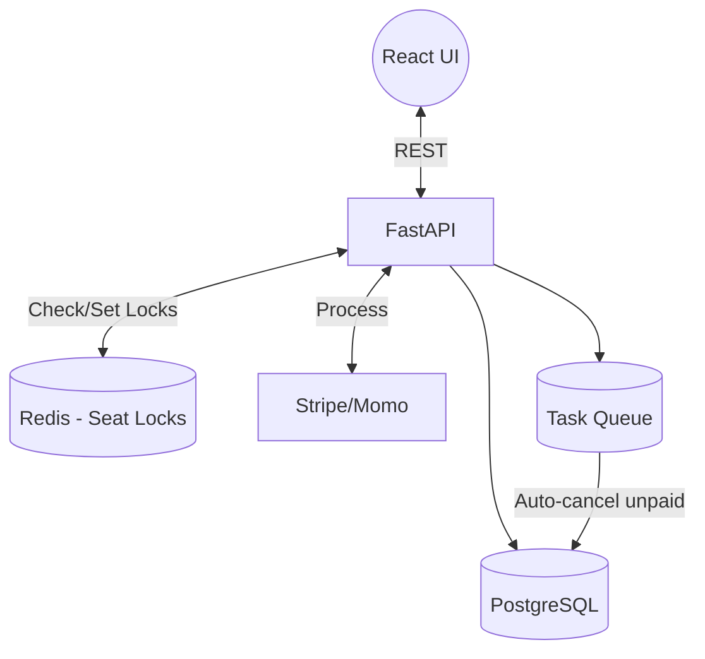
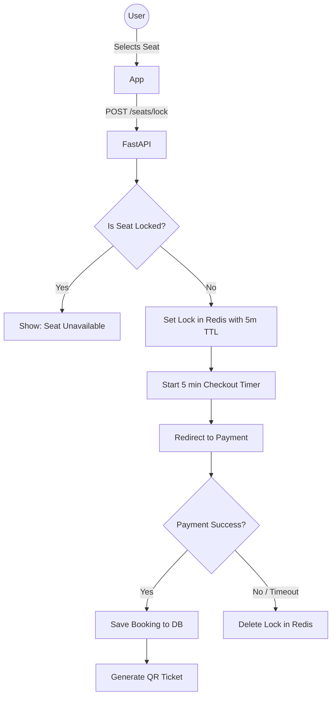

## CineFast Project Specifications

🚀 **Modern Movie Ticket Booking Platform** with real-time seat selection, aggregated showtimes, and lightning-fast checkouts.

---

## 📌 Problem (Core Idea)

Moviegoers face several frustrations with traditional booking platforms:

- Crashing or lagging during blockbuster movie releases.
- "Seat stealing" — selecting a seat only to find out it was booked by someone else at checkout.
- Clunky interfaces for finding showtimes across different dates and cinema locations.
- Cumbersome payment processes.

This creates a **poor user experience and lost revenue** for cinemas.

➡️ **CineFast provides a high-performance, real-time ticket booking experience with an interactive seat map, guaranteed seat locking, and instant QR-code ticketing.**

---

## 🧑‍💻 Users

| Persona                    | Needs                                           |
| -------------------------- | ----------------------------------------------- |
| Moviegoer (Customer)       | Browse movies, pick seats, pay quickly, get QR  |
| Cinema Manager             | Add movies, schedule showtimes, manage pricing  |
| Ticket Checker (Staff)     | Scan QR codes at the theater entrance           |
| System Admin               | View overall revenue, handle system failures    |

---

## ✨ Core Features

### A) Movie & Showtime Discovery
- Browse "Now Showing" and "Coming Soon" with trailers and ratings.
- Filter by date, cinema location, and format (2D, 3D, IMAX).

### B) Interactive Seat Selection
- Visual representation of the theater layout.
- **Real-time Seat Locking:** When a user clicks a seat, it locks for 5 minutes (via Redis). No one else can select it while they check out.
- Color-coded seats: Available, Selected, Locked, Sold.

### C) Booking & Payment
- Integration with payment gateways (Stripe, VNPay, Momo).
- Automatic timeout cancellation if payment is not completed in time.
- Digital E-Tickets generated as QR codes for quick scanning.

### D) Cinema Admin Panel
- CRUD operations for Movies, Cinemas, and Theater Rooms.
- Schedule management: Assign movies to rooms at specific times.
- Dashboard for ticket sales and revenue analytics.

---

## 🗄️ Data Model (Rough Database Draft)

> This schema uses Prisma format for readability, but represents the **PostgreSQL** schema used by Python FastAPI.

```prisma
model User {
  id        String    @id @default(cuid())
  email     String    @unique
  password  String
  name      String
  role      String    @default("CUSTOMER") // CUSTOMER | ADMIN | STAFF
  bookings  Booking[]
  createdAt DateTime  @default(now())
}

model Movie {
  id          String     @id @default(cuid())
  title       String
  description String?
  posterUrl   String
  trailerUrl  String?
  durationMin Int
  releaseDate DateTime
  showtimes   Showtime[]
}

model Cinema {
  id       String  @id @default(cuid())
  name     String
  location String
  rooms    Room[]
}

model Room {
  id        String     @id @default(cuid())
  cinemaId  String
  cinema    Cinema     @relation(fields: [cinemaId], references: [id])
  name      String     // e.g., "Room 1", "IMAX"
  seatMap   Json       // Defines rows and columns structure
  showtimes Showtime[]
}

model Showtime {
  id        String    @id @default(cuid())
  movieId   String
  movie     Movie     @relation(fields: [movieId], references: [id])
  roomId    String
  room      Room      @relation(fields: [roomId], references: [id])
  startTime DateTime
  endTime   DateTime
  price     Float
  bookings  Booking[]
}

model Booking {
  id            String   @id @default(cuid())
  userId        String
  user          User     @relation(fields: [userId], references: [id])
  showtimeId    String
  showtime      Showtime @relation(fields: [showtimeId], references: [id])
  status        String   // PENDING | PAID | CANCELLED
  totalAmount   Float
  qrCode        String?  @unique
  paymentIntent String?
  bookedSeats   Seat[]   // Relation to specific seats booked
  createdAt     DateTime @default(now())
}

model Seat {
  id         String  @id @default(cuid())
  bookingId  String
  booking    Booking @relation(fields: [bookingId], references: [id])
  row        String  // 'A', 'B', 'C'
  number     Int     // 1, 2, 3
}
```

---

## 🧱 Tech Stack

| Category     | Choice                                       |
| ------------ | -------------------------------------------- |
| Framework    | **ReactJS (Vite)** |
| Backend API  | **Python FastAPI** |
| Language     | TypeScript (Front) / Python (Back)           |
| Database     | PostgreSQL (via SQLAlchemy / Alembic)        |
| Caching/Lock | **Redis (Crucial for Seat Locking & caching)**|
| CSS/UI       | Tailwind CSS + ShadCN UI                     |
| Payments     | Stripe / Local Payment Gateways API          |
| Background   | Celery (for expiring pending bookings)       |
| Hosting      | Vercel (Front) + AWS/DigitalOcean (Back)     |

---

## 💰 Monetization / Business Model

| Revenue Stream         | Description                                     |
| ---------------------- | ----------------------------------------------- |
| Convenience Fee        | A small flat fee (e.g., $1) added per ticket.   |
| Premium Subscriptions  | $10/month for waived fees, early booking access.|
| Ads & Promotions       | Featured banners for upcoming blockbusters.     |

---

## 🎨 UI / UX

- **Dark Mode Default:** To mimic the cinematic experience and make movie posters pop.
- **Mobile-First Checkout:** Seamless Apple Pay/Google Pay integration.
- **Pinch-to-Zoom Seat Map:** Essential for mobile users selecting seats in large IMAX theaters.

### Layout

- **Home:** Hero carousel of hot movies, grid of "Now Showing".
- **Movie Detail:** Trailer modal, synopsis, and a date-picker for showtimes.
- **Seat Map:** Visual grid. Hover/Tap to see seat price. Floating action bar at the bottom with "Total Price" and "Checkout" button.
- **My Tickets:** Wallet-style view of upcoming and past tickets with bright QR codes.

---

## 🔌 API Architecture



---

## 🔐 Booking & Seat Locking Flow



---

## 🗂️ Development Workflow

- **Backend Phase 1:** Setup FastAPI, PostgreSQL, and basic CRUD for Movies/Cinemas.
- **Backend Phase 2:** Implement Redis distributed locks for the seat selection logic (The hardest part).
- **Frontend Phase 1:** Build the UI shell, Movie listings, and authentication.
- **Frontend Phase 2:** Build the interactive Seat Map component.
- **Integration:** Connect payment gateway, finalize the booking flow, and generate QR codes.

---

## 🧭 Roadmap

### **MVP**

- Browse movies and showtimes.
- Interactive seat selection with Redis locking.
- Basic payment simulation and ticket generation.

### **Phase 2: Real-world Readiness**

- Real Payment Gateway integration.
- Admin dashboard for cinema managers.
- QR code scanner UI for staff.

### **Phase 3: Enhancements**

- Combo booking (Popcorn & Drinks).
- Recommendation engine (similar movies).
- Loyalty point system.

---

## 📌 Status

- Architecture defined.
- Ready to initialize FastAPI backend and set up Redis containers.

---
